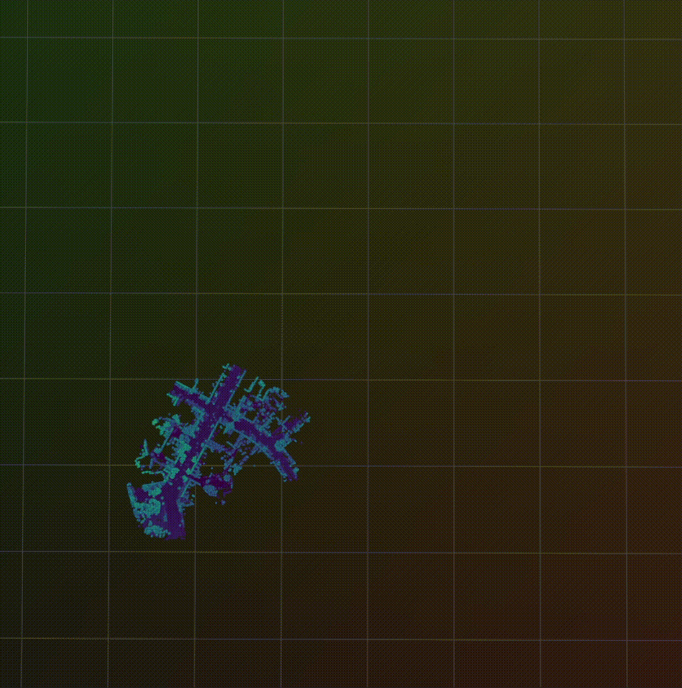

  <h1>MapBlend</h1>
  <h2>Consistent Long-Term Point Cloud Mapping with Prior Maps</h2>

   

  
  
  
  
  
  
   
  

## Release
Coming soon!  
~~07.02.2025 👀~~.  
Due to delays in the release of [OpenLiDARMap](https://github.com/TUMFTM/OpenLiDARMap), the core library of this approach, the release has been postponed to 15.02.2025
