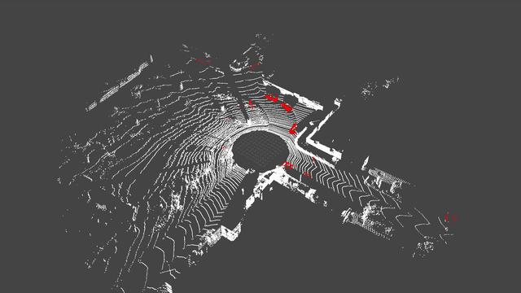

<div align="center">
  <h1>MapBlend</h1>
  <h2>Consistent Long-Term Point Cloud Mapping with Prior Maps</h2>

  <br>

  [](https://www.docker.com/)
  
  
  
  
  <br>
  
</div>

  
## PRELIMINARY version

This is a PRELIMINARY version

## Description

This repository is an extension to [OpenLiDARMap](https://github.com/TUMFTM/OpenLiDARMap), a zero-drift georeferenced LiDAR-only point cloud mapping algorithm.  
We combine the mapping module of OpenLiDARMap with the object detection module of [Autoware](https://autowarefoundation.github.io/autoware.universe/main/perception/autoware_lidar_centerpoint/) to filter movable objects before the mapping.  
Additionally, we enable the update of point cloud maps through a raycasting-based voxel-occlusion update strategy (THIS IS NOT YET AVAILABLE IN THIS REPOSITORY). 

## Install

```bash
git clone --recurse-submodules https://github.com/ga58lar/MapBlend.git

./docker/build_docker.sh
```

## Run

To run this repository, you will need a PC with a NVIDIA GPU.
You also need to download the lidar_centerpoint pre-trained models from [Autoware](https://autowarefoundation.github.io/autoware.universe/main/perception/autoware_lidar_centerpoint/).

```bash
./docker/run_docker.sh <model_path> <config_path> <map_path> <scan_path> <output_path> <x> <y> <z> <qx> <qy> <qz> <qw>
```

For a detailed instruction the the core module [OpenLiDARMap](https://github.com/TUMFTM/OpenLiDARMap), please refer to the official GitHub repository.

## Missing

- Object tracking module for robust movable object removal
- Life-long mapping module